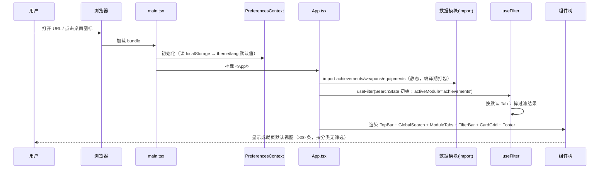
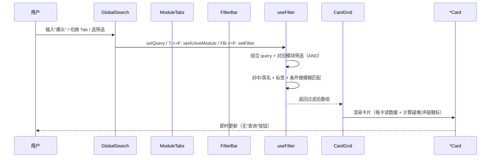
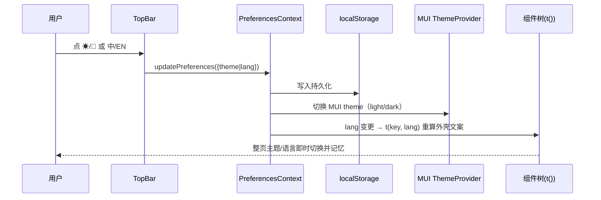

# 《深岩银河幸存者》(DRG: Survivor) 游戏助手 —— 架构设计 + 任务分解

> 文档类型：架构设计（Architecture Design） + 任务分解（Task Breakdown）
> 主理人：高见远（架构师）
> 状态：提交评审（部分事项待主理人/用户拍板，见第八节）
> 关联文档：PRD.md（已确认）、data-achievements.md（300 条）、data-weapons.md（42 把）、data-equipment.md（20 件）
> 技术栈：Vite + React + MUI + Tailwind CSS + vite-plugin-pwa（纯前端、无后端、数据内嵌）

---

## 一、实现方案 + 框架选型

### 1.1 技术栈与选型理由

| 维度 | 选型 | 理由 |
|---|---|---|
| 构建工具 | **Vite** | 秒级冷启动、HMR、原生 ESM，对纯前端 PWA 零摩擦；`vite-plugin-pwa` 一等公民支持。 |
| UI 框架 | **React 18** | 组件化、生态成熟；与 MUI 原生契合。 |
| 组件库 | **MUI (Material UI)** | PRD 明确指定 `Card`/`Chip`/`Tab`；深色主题开箱即用，`ThemeProvider` 直接驱动明暗切换。 |
| 样式 | **Tailwind CSS** | 布局级原子类（flex-wrap 响应式网格、间距），与 MUI 互补——MUI 管组件，Tailwind 管布局。 |
| PWA | **vite-plugin-pwa** | 自动生成 manifest + service worker（Workbox），离线缓存内嵌数据，支持"添加到主屏幕"。 |
| 状态管理 | **React Context**（见 1.3） | 全局状态仅"主题 + 语言 + 当前 Tab + 搜索/筛选"，量级极小，Context 足够，无需 Redux/Zustand。 |
| i18n | **轻量自研 key 映射**（见 1.4，推荐） | 数据本身已含中英双字段，仅需翻译"界面外壳"文案，自研 `dict` 即可，零运行时开销。 |

### 1.2 PWA 离线 / 可安装方案（vite-plugin-pwa 配置要点）

采用 **`registerType: 'autoUpdate'`** + **`workbox` 预缓存策略**，因为数据全内嵌、无远程接口，离线即开即用。

```ts
// vite.config.ts (要点，非完整代码)
import { VitePWA } from 'vite-plugin-pwa'
export default defineConfig({
  plugins: [
    react(),
    VitePWA({
      registerType: 'autoUpdate',        // 静默后台更新，用户无感
      includeAssets: ['favicon.svg', 'icons/icon-192.png', 'icons/icon-512.png'],
      manifest: {
        name: 'DRG: Survivor 助手',
        short_name: 'DRG助手',
        description: '深岩银河幸存者 成就/武器/装备速查',
        theme_color: '#F5A623',
        background_color: '#0d0d0d',
        display: 'standalone',
        start_url: '/',
        icons: [
          { src: 'icons/icon-192.png', sizes: '192x192', type: 'image/png' },
          { src: 'icons/icon-512.png', sizes: '512x512', type: 'image/png', purpose: 'any maskable' },
        ],
      },
      workbox: {
        globPatterns: ['**/*.{js,css,html,svg,png,woff2}'], // 预缓存所有构建产物 + 静态资源
        cleanupOutdatedCaches: true,
      },
    }),
  ],
})
```

要点说明：
- **可安装**：`manifest.display: 'standalone'` + 192/512 两张图标 + `theme_color`，满足浏览器 A2HS 条件。
- **离线**：`globPatterns` 把 JS/CSS/HTML/图标全部预缓存，首次访问后即离线可用（数据已打包进 JS bundle）。
- **更新**：`autoUpdate` 在 SW 激活后自动接管，无需刷新提示（速查场景不打断用户）。
- **自注册**：在 `main.tsx` 引入 `virtual:pwa-register` 的 `registerSW({ immediate: true })`。

> 图标资源（192/512）需主理人提供或我方用占位图生成（见待明确事项 D4）。

### 1.3 状态管理方案

**结论：React Context 足够，不引入 Redux/Zustand。**

全局状态仅两类：
1. **UI 偏好态**（theme / lang）——低频变更、跨组件、需持久化 → `PreferencesContext`。
2. **检索态**（当前 Tab / 搜索词 / 各模块筛选）——中频变更、集中在一处 → `useSearchAndFilter` hook 内部 `useState`，通过 props 下钻或轻量 `FilterContext` 共享。

数据本身是**静态常量**（编译期写入 `achievements.ts` 等），不参与运行时状态，直接 import 即可。

### 1.4 i18n 方案（推荐：轻量自研 key 映射）

| 方案 | 优点 | 缺点 | 结论 |
|---|---|---|---|
| **轻量自研 `dict`（推荐）** | 零依赖、零打包体积；界面外壳文案仅约 30 条；数据已有中英双字段，无需翻译数据 | 需手动维护 key | ✅ 采用 |
| i18next + react-i18next | 功能全（插值/复数/命名空间） | 对本项目过度设计，增 ~30KB 体积，学习成本 | ❌ 不采用 |

自研形态（仅外壳文案）：

```ts
// i18n/dict.ts
export type Lang = 'zh' | 'en'
export const ui: Record<string, Record<Lang, string>> = {
  'app.title':       { zh: 'DRG: Survivor 助手', en: 'DRG: Survivor Helper' },
  'tab.achievements':{ zh: '成就', en: 'Achievements' },
  'tab.weapons':     { zh: '武器', en: 'Weapons' },
  'tab.equipments':  { zh: '装备', en: 'Equipment' },
  'search.placeholder': { zh: '搜索中/英文名、标签、条件…', en: 'Search name/tag/condition…' },
  'rating.disclaimer':  { zh: '评级为玩家主观评价，仅供参考', en: 'Ratings are subjective, for reference only' },
  // … 约 30 条
}
export const t = (k: string, lang: Lang) => ui[k]?.[lang] ?? k
```

> 数据字段（成就中/英名、武器中/英名等）直接读数据对象，不走 i18n。

---

## 二、文件列表及相对路径（项目文件树）

```
drg-survivor-helper/
├── index.html                      # 入口 HTML（挂载 #root，含 manifest 链接由插件注入）
├── package.json
├── vite.config.ts                  # Vite + @vitejs/plugin-react + vite-plugin-pwa 配置
├── tailwind.config.js              # Tailwind 指令/扫描 src
├── postcss.config.js               # Tailwind + autoprefixer
├── tsconfig.json                   # TS 配置（含 types: vite/client, vite-plugin-pwa/client）
├── tsconfig.node.json
├── public/
│   ├── favicon.svg
│   └── icons/
│       ├── icon-192.png            # PWA 图标（待提供/生成）
│       └── icon-512.png
├── references/                     # 需求与底稿（本项目只读参考，不进 bundle）
│   ├── PRD.md
│   ├── ARCHITECTURE.md             # ← 本文档
│   ├── data-achievements.md
│   ├── data-weapons.md
│   └── data-equipment.md
└── src/
    ├── main.tsx                    # 入口：挂载 App + 注册 SW + 包 Provider
    ├── App.tsx                     # 顶层布局：Provider 组合 + 顶栏 + 搜索 + Tab + 结果 + 页脚
    ├── vite-env.d.ts               # 声明 virtual:pwa-register / *.svg 等
    │
    ├── theme/
    │   ├── ThemeContext.tsx        # 明暗主题 Context + localStorage 记忆
    │   ├── createAppTheme.ts       # MUI 主题工厂（light/dark 两态，注入 Tailwind 色调）
    │   └── PreferencesContext.tsx  # 主题+语言合并偏好 Context（持久化）
    │
    ├── i18n/
    │   ├── dict.ts                 # 外壳文案 key 映射 + t() + Lang 类型
    │   └── LangContext.tsx         # 语言 Context + localStorage 记忆
    │
    ├── data/                       # 数据模块（底稿 → TS 常量，直接来源）
    │   ├── types.ts                # Achievement / Weapon / Equipment / 枚举 / 筛选态类型定义
    │   ├── achievements.ts         # export const achievements: Achievement[]  （300 条）
    │   ├── weapons.ts              # export const weapons: Weapon[]            （42 条）
    │   ├── equipments.ts           # export const equipments: Equipment[]      （20 件）
    │   └── enums.ts                # 分类枚举(19)、职业、评级、来源 等常量集合
    │
    ├── hooks/
    │   ├── useFilter.ts            # 搜索 + 各模块筛选组合（AND）逻辑
    │   ├── useAchievementFilter.ts # 成就：分类 + 疑难开关过滤
    │   ├── useWeaponFilter.ts      # 武器：职业 + 评级 + 标签过滤
    │   └── useEquipmentFilter.ts   # 装备：类型 + 来源过滤
    │
    ├── components/
    │   ├── TopBar.tsx              # 标题 + 语言切换 + 主题切换
    │   ├── GlobalSearch.tsx        # 常驻全局搜索框
    │   ├── ModuleTabs.tsx          # 成就/武器/装备 三 Tab（当前态）
    │   ├── FilterBar.tsx           # 随 Tab 变化的筛选区容器（路由到各模块筛选子组件）
    │   ├── Footer.tsx              # 数据来源 + 免责（含评级主观声明）
    │   │
    │   ├── cards/
    │   │   ├── AchievementCard.tsx # 成就卡片（含疑难分档徽标逻辑）
    │   │   ├── WeaponCard.tsx      # 武器卡片（评级徽章 + 超频 + 标签 chip）
    │   │   ├── EquipmentCard.tsx   # 装备卡片（类型/来源 chip + 关联成就）
    │   │   └── CardGrid.tsx        # 响应式 flex-wrap 网格容器
    │   │
    │   ├── badges/
    │   │   ├── RatingBadge.tsx     # S/A/B/C/- 色阶徽章（标注"主观"）
    │   │   ├── DifficultyBadge.tsx # 疑难分档角标（极难/难/较难，<10% 最强权重）
    │   │   └── TagChip.tsx         # 可点击标签 chip（写入搜索/筛选）
    │   │
    │   └── filters/
    │       ├── AchievementFilters.tsx
    │       ├── WeaponFilters.tsx
    │       └── EquipmentFilters.tsx
    │
    └── __tests__/                  # Vitest + Testing Library 测试
        ├── useFilter.test.ts
        ├── AchievementCard.test.tsx
        ├── WeaponCard.test.tsx
        ├── DifficultyBadge.test.tsx   # 空达成率不高亮断言
        └── PreferencesContext.test.tsx
```

**文件数量级：src/ 下约 35 个文件，项目根 + 配置约 12 个，总计 ≈ 47 个。** 远超 10 个，印证标准 SOP 拆分（脚手架/数据/Provider/布局/搜索/三模块/徽章/页脚/PWA/测试）的合理性。

---

## 三、数据结构和接口（TypeScript 类型定义）

### 3.1 数据实体类型（严格对应底稿表头）

```ts
// src/data/types.ts

/** 成就分类：底稿 19 类（PRD 4.2） */
export type AchievementCategory =
  | '职业解锁' | '职业进阶' | '属性统计' | '装备' | '武器超频'
  | '武器精通' | '武器真精通' | '生物群系' | '武器标签' | '生物'
  | '资源' | '神器' | '商店' | '环境' | '伤害' | '护卫'
  | '异常·先锋·致命' | '耐力' | '其他动作'

/** 生物群系档位（仅"生物群系"类成就填，其余为空） */
export type BiomeTier = 'H5' | 'Mastery' | 'TrueMastery'

export interface Achievement {
  englishName: string
  chineseName: string
  category: AchievementCategory
  unlockCondition: string
  /** 仅生物群系类有值；其余为 undefined */
  biomeTier?: BiomeTier
  /** 关键：达成率。239/300 有值，61 条为空 → 用 number | null。
   *  空值 UI 一律不渲染徽标、不高亮（决策 5）。 */
  completionRate: number | null
  version: string            // '当前' / '待核' 等
}

/** 职业 */
export type WeaponClass = 'Scout' | 'Gunner' | 'Engineer' | 'Driller'

/** 强度评级（攻略作者主观，UI 须标注仅供参考，决策 7） */
export type Rating = 'S' | 'A' | 'B' | 'C' | '-'

export interface Weapon {
  englishName: string
  chineseName: string
  class: WeaponClass
  /** 底稿逗号分隔 → 解析为数组，供 chip 渲染与标签筛选 */
  tags: string[]
  /** 黄色超频（6/12 级），整列文本展示 */
  yellowOverclock: string
  /** 红色超频（18 级），整列文本展示 */
  redOverclock: string
  rating: Rating
  /** 版本标记；允许 '待核'（规范名待核，决策 6） */
  version: string
  /** 可选：待核备注（如等离子切割器映射歧义） */
  note?: string
}

/** 装备来源 */
export type EquipmentSource = '局内附加' | '成就解锁'

export interface Equipment {
  name: string
  type: string
  effect: string
  source: EquipmentSource
  /** 成就解锁类填对应成就英文名；局内附加为空 */
  relatedAchievement?: string
  version: string          // 允许 '待核'（1.0 可能新增，决策 6）
}
```

### 3.2 UI 偏好 / 检索态类型

```ts
// src/data/types.ts （续）

export type ThemeMode = 'light' | 'dark'
export type Lang = 'zh' | 'en'

/** UI 偏好（持久化到 localStorage） */
export interface UiPreferences {
  theme: ThemeMode
  lang: Lang
}

/** 当前激活模块 */
export type ModuleKey = 'achievements' | 'weapons' | 'equipments'

/** 全局检索态：搜索词 + 当前 Tab + 各模块筛选（AND 组合） */
export interface SearchState {
  query: string
  activeModule: ModuleKey
  achievement: {
    category?: AchievementCategory
    /** 疑难高亮开关（按分档展示，非二元） */
    onlyDifficult: boolean
  }
  weapon: {
    class?: WeaponClass
    rating?: Rating
    tags: string[]          // 已选标签（点击 chip 累积）
  }
  equipment: {
    type?: string
    source?: EquipmentSource
  }
}
```

### 3.3 数据模块导出约定（共享知识，见第七节）

```ts
// 三个数据文件统一导出形式：
export const achievements: Achievement[] = [ /* 300 */ ]
export const weapons: Weapon[] = [ /* 42 */ ]
export const equipments: Equipment[] = [ /* 20 */ ]
```

---

## 四、程序调用流程（时序图）

### 4.1 启动 + 默认渲染



### 4.2 搜索 / 筛选 交互流



### 4.3 主题 / 语言 切换数据流



---

## 五、任务列表（有序、含依赖、按实现顺序）

> 依赖关系：`→` 表示前置。编号 T1–T12 对应 PRD 分解建议。

| ID | 任务 | 交付物 | 依赖 | 关键说明 |
|---|---|---|---|---|
| **T1** | 脚手架 + 依赖 | Vite+React+TS 工程、Tailwind、vite.config.ts、package.json | 无 | 先 `npm create vite` 骨架，装 MUI/Tailwind/PWA 依赖 |
| **T2** | 数据类型 + 底稿转 TS | `types.ts` / `enums.ts` / `achievements.ts`(300) / `weapons.ts`(42) / `equipments.ts`(20) | T1 | 严格对应表头；**空达成率→`null`；标签逗号→数组；待核/版本原样保留不杜撰** |
| **T3** | 主题/语言 Provider | `ThemeContext` / `LangContext` / `PreferencesContext` / `createAppTheme` | T1 | localStorage 记忆；合并为单一 PreferencesContext 更优 |
| **T4** | 布局 + 顶栏 + Tab | `App.tsx` / `TopBar` / `ModuleTabs` / `GlobalSearch` / `FilterBar` 容器 | T3 | 常驻三件套；Shell 框架搭好 |
| **T5** | 全局搜索 hook | `useFilter` + 三个子 filter hook | T2, T4 | 跨模块模糊匹配（中/英/标签/条件）；AND 组合 |
| **T6** | 成就模块 | `AchievementCard` / `AchievementFilters` / `useAchievementFilter` | T5 | 19 类筛选；疑难分档徽标 |
| **T7** | 武器模块 | `WeaponCard` / `WeaponFilters` / `useWeaponFilter` | T5 | 职业/评级/标签筛选；超频文本；评级徽章 |
| **T8** | 装备模块 | `EquipmentCard` / `EquipmentFilters` / `useEquipmentFilter` | T5 | 类型/来源筛选；关联成就展示 |
| **T9** | 评级徽章 / 标签 chip / 疑难高亮 | `RatingBadge` / `DifficultyBadge` / `TagChip` | T6, T7, T8 | S金/A/B/C色阶；**<10% 最强权重**；chip 可点击回填 |
| **T10** | 页脚免责 | `Footer.tsx` | T4 | 数据来源 + **评级主观声明**（必含） |
| **T11** | PWA 配置 | manifest + SW + 图标 + `registerSW` | T1 | autoUpdate；离线；可安装 |
| **T12** | 响应式打磨 + 测试 | `CardGrid` flex-wrap / `__tests__/*` | T6–T11 | 移动单列/桌面多列；Vitest 覆盖关键逻辑 |

**关键依赖链**（决定并行度）：
- T1 是全部前置。
- T2（数据）与 T3（Provider）可在 T1 后**并行**。
- T4 依赖 T3；T5 依赖 T2+T4；T6/T7/T8 均依赖 T5，三者**可并行**。
- T9 依赖 T6/T7/T8 完成卡片后统一做徽章。
- T10、T11 相对独立，可在 T4 后逐步接入。
- T12 收尾（含测试）。

---

## 六、依赖包列表

| 包 | 版本倾向 | 用途 |
|---|---|---|
| `react` / `react-dom` | ^18 | UI 框架 |
| `@mui/material` | ^5/^6 | 组件库（Card/Chip/Tab/Select/AppBar…） |
| `@emotion/react` | ^11 | MUI 样式引擎（peer） |
| `@emotion/styled` | ^11 | MUI 样式引擎（peer） |
| `@mui/icons-material` | ^5/^6 | 顶栏主题/语言/搜索图标 |
| `tailwindcss` | ^3 | 布局原子类（flex-wrap 响应式网格） |
| `postcss` / `autoprefixer` | ^8 | Tailwind 构建管线 |
| `vite` | ^5 | 构建工具 |
| `@vitejs/plugin-react` | ^4 | React 插件 |
| `vite-plugin-pwa` | ^0.20+ | manifest + service worker（离线/可安装） |
| `typescript` | ^5 | 类型系统 |
| **测试**：`vitest` | ^1/^2 | 单元/组件测试运行器 |
| **测试**：`@testing-library/react` | ^14/^16 | React 组件测试 |
| **测试**：`@testing-library/jest-dom` | ^6 | 断言扩展 |
| **测试**：`jsdom` | ^24 | 测试 DOM 环境 |

> 不引入：redux / zustand（Context 足够）、i18next（自研 dict）、react-router（单页 Tab 状态切换，见待明确 D3）。

---

## 七、共享知识（跨文件约定）

1. **命名规范**
   - 数据实体接口：`PascalCase`（`Achievement`）；常量数组：`camelCase` 复数（`achievements`）。
   - 组件：`PascalCase` 单文件单组件（`AchievementCard.tsx`）。
   - Hook：`use` 前缀（`useFilter`）。
   - 类型文件集中 `src/data/types.ts`，枚举常量集中 `src/data/enums.ts`。

2. **数据模块导出格式**（强制统一）
   ```ts
   // src/data/achievements.ts
   import type { Achievement } from './types'
   export const achievements: Achievement[] = [ /* 300 条，字段严格对应表头 */ ]
   ```
   武器/装备同理。组件内 `import { achievements } from '../data/achievements'`。

3. **主题/语言 Context 用法**
   - 顶层 `App` 用 `<PreferencesProvider>` 包裹；消费：
     ```tsx
     const { theme, lang, setTheme, setLang } = usePreferences()
     ```
   - 外壳文案：`const { lang } = usePreferences(); t('tab.achievements', lang)`。
   - 数据字段直接读对象（如 `ach.chineseName`），**不**经 `t()`。

4. **空达成率处理约定（决策 5，全局统一）**
   - 类型上 `completionRate: number | null`。
   - `DifficultyBadge` 收到 `null` 时：**不渲染任何徽标、不高亮、不打角标**，且不抛错、不回退到 0%。
   - 任何卡片/列表逻辑遇到 `null` 一律"视而不见"，绝不以 0 或占位值误标稀有度。

5. **"待核 / 版本标记"约定（决策 6）**
   - `version` 字段原样保留 `'当前'` / `'待核'`；若有 `note` 备注一并保留。
   - UI 可对 `version === '待核'` 的卡片加极轻量提示（如小问号），但**绝不篡改/补全**规范名。

6. **评级主观声明约定（决策 7）**
   - `RatingBadge` 旁固定标注"主观/仅供参考"；页脚 `Footer` 统一再声明一次（P1 必含）。

7. **搜索匹配约定**
   - 模糊匹配大小写不敏感；匹配字段：成就（中/英名、解锁条件、分类）、武器（中/英名、标签、职业）、装备（名称、类型、效果、来源）。
   - 搜索词与筛选为 **AND** 关系；空搜索词视为"不过滤"。

---

## 八、待明确事项（需主理人/用户拍板）

| 编号 | 事项 | 现状 / 我的倾向 | 需拍板点 |
|---|---|---|---|
| **D1** | **i18n 选型** | 我推荐轻量自研 `dict`（见 1.4），零依赖够用 | 是否同意自研，还是坚持上 i18next？ |
| **D2** | **测试框架** | 我按 PRD 暗示选 Vitest + Testing Library（见六/十二） | 是否接受 Vitest，或要求 Jest？ |
| **D3** | **路由 vs 单页 Tab** | 我倾向**单页 Tab 状态切换**（无 react-router），因 PRD 无深链/分享 URL 需求，更轻 | 是否需要 URL 可分享（如 `#/weapons`）？若需则引入轻量路由 |
| **D4** | **PWA 图标素材** | 需 192/512 PNG；我可先用占位图保证可安装 | 主理人是否提供正式图标，或授权我用占位图生成？ |
| **D5** | **数据录入方式** | 300 成就/42 武器/20 装备需从 markdown 转 TS（T2） | 是否允许我**编写一次性转换脚本**解析底稿生成 `.ts`，还是纯手工录入？（影响 T2 工时与准确率） |
| **D6** | **装备英文名缺失** | 底稿装备仅中文名（无英文字段），与成就/武器双字段不一致 | 装备是否只需中文名展示，还是需补英文（用户故事未提装备英文检索）？ |
| **D7** | **疑难高亮开关默认态** | PRD 说"⚠疑难高亮 开/关"；我默认**开** | 默认开还是默认关？分档阈值已确认（极难<10%/难10–30%/较难30–50%）。 |

---

## 附：架构决策速记（对 PRD 关键决策的落地映射）

- 决策 1（技术栈）→ 第一节、第六节。
- 决策 2（PWA 离线/可安装）→ 1.2、T11。
- 决策 3（三模块 + 全局搜索 + 随 Tab 筛选）→ 类型/状态设计、T4–T8、T5。
- 决策 4（中英记忆 + 明暗记忆 + 疑难分档）→ T3、T9、1.4；`<10%` 最强视觉权重见 `DifficultyBadge`。
- 决策 5（空达成率不高亮）→ 第七节第 4 条 + `DifficultyBadge` 约定 + 测试 `DifficultyBadge.test.tsx`。
- 决策 6（待核/版本不杜撰）→ 第七节第 5 条。
- 决策 7（评级主观标注）→ 第七节第 6 条 + `RatingBadge` + `Footer`。
- 本期不做（收藏/对比、导出）→ 不在任何任务中，留 P2。
