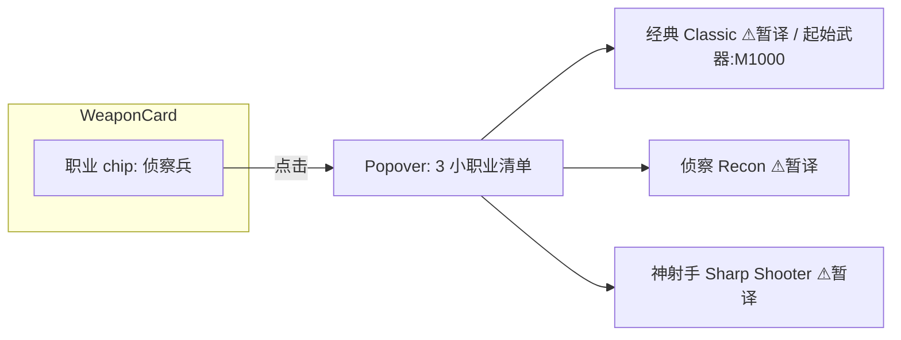
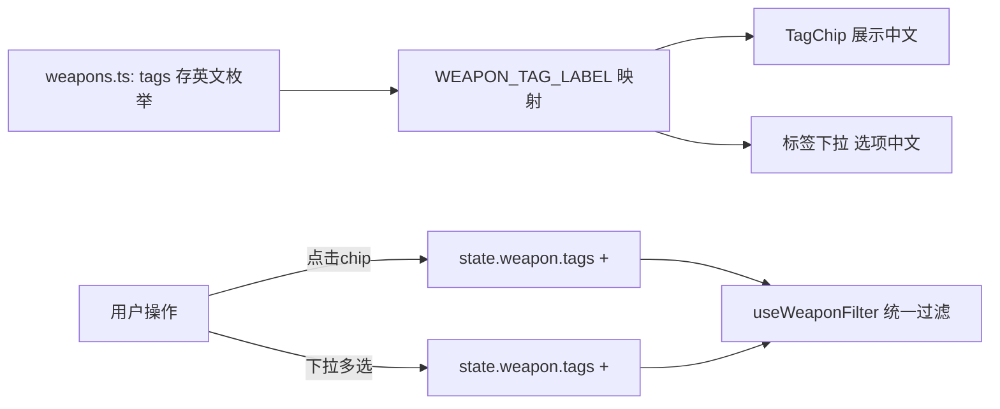
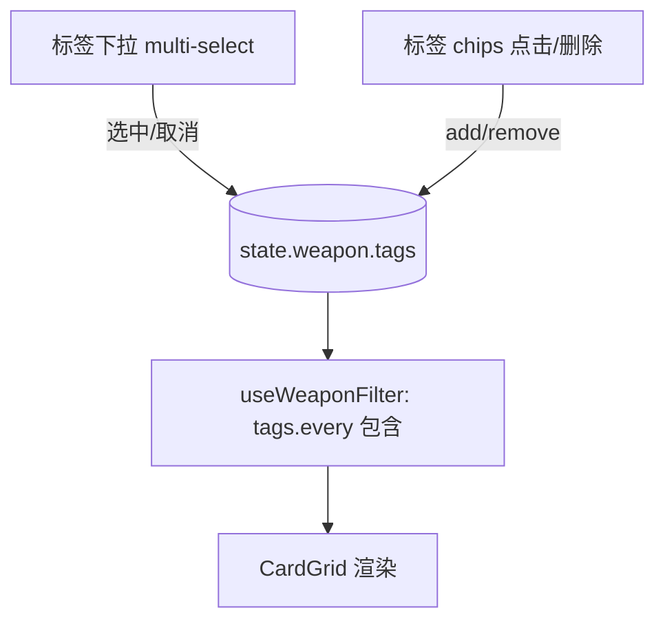

# 《DRG: Survivor 助手》增量调整 PRD（2026-07-08）

> 文档类型：增量 PRD（仅描述变更，非重写整份 PRD）
> 作者：产品经理 许清楚（Xu）
> 关联：PRD.md（已确认）、ARCHITECTURE.md（已确认）、主理人齐活林的官方 Wiki 调研（A/B 节，可直接采用）
> 技术栈：Vite + React + MUI + Tailwind CSS + vite-plugin-pwa（纯前端、无后端、数据内嵌，不变）
> 范围：本期 5 项用户调整（职业中文名+小职业 / 去中英混杂 / 成就难度排序 / 武器标签改官网标签 / 武器筛选新增标签下拉）

---

## 0. 变更总览

| # | 调整项 | 变更性质 | 涉及新增/修改 |
|---|---|---|---|
| 1 | 职业中文名 + 每职业 3 小职业（中英文） | 新增数据层 + UI | 新增 `src/data/classes.ts`；职业/小职业展示改造 |
| 2 | 尽量不要中英混杂 | UI 展示规范 | 职业/小职业/标签的文案语言策略统一 |
| 3 | 成就按难度排序 | 排序逻辑（前端数组） | `useAchievementFilter` 默认排序 |
| 4 | 武器标签改官网原始标签 | 数据字段语义替换 | `Weapon.tags` 改存官网四类标签枚举 |
| 5 | 武器筛选新增标签下拉 | 筛选器新增 | `WeaponFilters` 新增可选标签下拉 |

> **不变项（明确排除，避免工程师误改）**：成就/装备数据结构、三大模块框架、全局搜索、疑难高亮分档、评级徽章、PWA、明暗/语言切换机制均保持不变。武器现有 `class` 字段（4 大类英文名）**保持不变**，仅 UI 改为显示中文职业名。

---

## 1. 职业数据层新增规格

### 1.1 新增文件 `src/data/classes.ts`

数据权威来源：主理人调研 A 节（deeprockgalactic.wiki.gg `Survivor:Class_Mods`，4 职业 × 3 小职业 = 12）。
**标注规则**：4 职业大类中文名为 DRG 社区通用译名（非暂译）；12 小职业中文名为基于英文含义的**暂译**（Wiki 无官方中文），UI/数据中须标注"暂译"。

```ts
// src/data/classes.ts
import type { WeaponClass } from './types'

/** 小职业（Class Mod）—— 暂译中文，需标注"暂译" */
export interface ClassMod {
  englishName: WeaponClass extends never ? never : string // 如 'Classic' / 'Recon'
  chineseName: string    // 暂译，如 '经典' / '侦察'
  /** 是否暂译（运行时用于 UI 角标，来源于 Wiki 无官方中文） */
  isTentative: true
  /** 小职业能力简述（来源于 Wiki，可选，待主理人/工程补全） */
  desc?: string
  /** 推荐/起始武器（英文规范名，与主数据 weapons.ts 对齐；来源 Wiki Class_Mods） */
  startWeapon?: string
}

/** 职业大类（武器归属维度，与 Weapon.class 一一对应） */
export interface GameClass {
  /** 与 WeaponClass 完全一致，如 'Scout' */
  englishName: WeaponClass
  /** 社区通用译名，非暂译，如 '侦察兵' */
  chineseName: string
  subclasses: ClassMod[]
}

export const classes: GameClass[] = [
  {
    englishName: 'Scout',
    chineseName: '侦察兵',
    subclasses: [
      { englishName: 'Classic',      chineseName: '经典',   isTentative: true },
      { englishName: 'Recon',        chineseName: '侦察',   isTentative: true },
      { englishName: 'Sharp Shooter',chineseName: '神射手', isTentative: true },
    ],
  },
  {
    englishName: 'Gunner',
    chineseName: '机枪手',
    subclasses: [
      { englishName: 'Weapons Specialist', chineseName: '武器专家', isTentative: true },
      { englishName: 'Juggernaut',         chineseName: '重装兵',   isTentative: true },
      { englishName: 'Heavy Gunner',       chineseName: '重机枪手', isTentative: true },
    ],
  },
  {
    englishName: 'Engineer',
    chineseName: '工程师',
    subclasses: [
      { englishName: 'Maintenance Worker', chineseName: '维修工', isTentative: true },
      { englishName: 'Tinkerer',           chineseName: '工匠',   isTentative: true },
      { englishName: 'Demolitionist',      chineseName: '爆破手', isTentative: true },
    ],
  },
  {
    englishName: 'Driller',
    chineseName: '钻机手',
    subclasses: [
      { englishName: 'Foreman',      chineseName: '工头',   isTentative: true },
      { englishName: 'Interrogator', chineseName: '审讯者', isTentative: true },
      { englishName: 'Strong Armed', chineseName: '强臂',   isTentative: true },
    ],
  },
]
```

### 1.2 武器 `class` 字段保持不变（重要边界）

- 武器数据 `Weapon.class` 仍是 4 大类英文名（`Scout`/`Gunner`/`Engineer`/`Driller`），**不改、不新增 subclass 绑定字段**。
- 理由（主理人调研 A 节）：在 DRG Survivor 中，Class Mod（小职业）是玩家选择的能力变体，每个 Class Mod 有 Recommended/起始武器；**武器本身按职业大类归属，小职业不是武器的 1:1 绑定字段**。
- 因此 UI 仅把职业大类英文名渲染为**中文**（如 `Scout` → `侦察兵`），小职业信息不作为武器过滤维度。

### 1.3 小职业在 UI 的具体呈现 —— 推荐方案（⚠ 待确认）

当前应用**没有"职业模块"**，小职业数据无处承载。推荐两种落地方式，需主确认：

**方案 A（推荐 · 卡片内联）**：武器卡片上的"职业"chip 改为可点击，点击弹出 MUI `Popover`/`Tooltip`，展示该职业下 3 个小职业清单：
`中文名(英文名) ⚠暂译` + `desc` + `起始武器：<武器中文名>`。武器过滤仍只按大类。

**方案 B（筛选二级下拉）**：武器筛选「职业」下拉改为二级——职业中文名下挂 3 小职业中文名可选。
> ⚠ 风险：小职业不是武器绑定字段，选中小职业后**无法过滤武器**（武器无 subclass 字段）。故方案 B 仅作"浏览/教学"用途，不联动武器结果，价值有限。**除非后续为武器补充 subclass 字段，否则不推荐**。

**默认采用方案 A**；若采用方案 B，需同步在 `types.ts` 为 `Weapon` 增加 `subclass?` 字段并在主数据补录（超出本期建议范围，标注待确认）。



---

## 2. 去中英混杂规范（UI 展示规则）

目标：职业/小职业/官网标签不再"裸奔英文"，避免同一视图内中英文随意混排。

### 2.1 专有名词语言策略（职业 / 小职业 / 官网标签）

采用**随全局语言切换的条件双标**，复用现有 `lang` Context（外壳文案已有 i18n 机制，继续用）：

| 当前语言 `lang` | 显示规则 | 示例 |
|---|---|---|
| `zh` | `中文(英文)` 固定双语标注 | `侦察兵(Scout)`、`动能(KINETIC)`、`神射手(Sharp Shooter) ⚠暂译` |
| `en` | 仅英文，不显示中文 | `Scout`、`KINETIC`、`Sharp Shooter` |

> 该规则保证：zh 视图永无裸英文专有名词，en 视图永无中文，且不会在同一视图随机混排。

### 2.2 各区域文案语言策略

| 区域 | 策略 | 说明 |
|---|---|---|
| 顶栏 / Tab / 筛选标签 / 页脚 | 走现有 `t(key, lang)` i18n | 不变，已支持中英切换并记忆 |
| 数据实体名（武器/成就中英文名） | 保持现有"主名按 lang、副名显示另一语言"的纵向双语布局 | 这是结构化双语参考，不视为"混杂"；**不改** |
| 职业 chip | 按 2.1 规则显示中文(英文)，hover/Popover 补英文 | 替换原 `label={weapon.class}` 裸英文 |
| 标签 chip（武器） | 按 2.1 规则由官网标签枚举映射显示 | 替换原攻略中文标签裸显 |
| 筛选下拉选项（职业/评级/标签） | 选项文本按 2.1 规则显示 | 职业下拉不再裸 `Scout` |
| 小职业说明 | 按 2.1 规则，且带 `⚠暂译` 角标 | 明确来源 |

### 2.3 备选方案（⚠ 待确认，非默认）

若主理人/用户坚持"全局固定双标"而非随语言切换，则无论 `lang` 如何，专有名词一律 `中文(英文)`。默认不采用（与现有 i18n 切换体验不一致），仅列作备选。

---

## 3. 成就难度排序规则

- **排序键**：`completionRate`（数值越低 = 达成率越低 = 越难 = 排最前）。
- **`null` 处理**：61 条空达成率排**末尾**（视为 `Infinity`）。
- **排序位置**：作为成就模块**默认排序**（前端数组排序，数据静态无后端）。
- **不冲突**：叠加现有「分类筛选」与「⚠疑难高亮」——分类为过滤（filter），高亮为卡片渲染开关（show），排序仅重排结果顺序，三者正交。
- **稳定性**：使用 JS 原生稳定排序（`Array.prototype.sort`，ES2019+ 稳定），相等值/空值之间保持底稿原相对顺序。

### 3.1 实现落点

在 `src/hooks/useAchievementFilter.ts` 的 `filterAchievements` 末尾，对过滤结果排序：

```ts
// 默认难度排序：completionRate 升序，null 末尾
function sortByDifficulty(list: Achievement[]): Achievement[] {
  return [...list].sort((a, b) => {
    const ra = a.completionRate ?? Infinity
    const rb = b.completionRate ?? Infinity
    return ra - rb
  })
}
```

> `useFilter.ts` / `SearchState` **无需新增字段**；排序是纯展示层重排。若未来需"按原序/按难度"切换，再在 `SearchState.achievement` 加 `sortBy` 字段（本期不做，标注）。

---

## 4. 武器标签替换方案（官网四类标签）

### 4.1 字段语义变更

`Weapon.tags: string[]` 由**攻略标签**（如 `["狙击","壮男孩"]`）替换为**官网原始标签**（主理人调研 B 节，四类）。

- **存值**：官网英文枚举（如 `"KINETIC"`、`"SPRAY"`、`"LIGHT"`、`"PROJECTILE"`）。
- **展示**：中文经映射表显示（如 `动能(KINETIC)`）。
- **多值**：一把武器可跨多类持有多个标签（如同时有伤害类型+武器家族+射击类型），故 `tags` 仍为数组，元素类型为新增 `WeaponTag` 联合枚举。

### 4.2 官网标签枚举 + 中英双存映射（写入 `src/data/enums.ts` 或新增 `tags.ts`）

```ts
// 官网四类标签（Survivor:Weapons）
export type WeaponTag =
  // 伤害类型 Damage type
  | 'KINETIC' | 'FIRE' | 'ELECTRICAL' | 'COLD' | 'ACID' | 'PLASMA'
  // 武器家族 Weapon family
  | 'LIGHT' | 'MEDIUM' | 'HEAVY' | 'THROWABLE' | 'CONSTRUCT'
  // 武器类型 Weapon type
  | 'PROJECTILE' | 'EXPLOSIVE' | 'DRONE' | 'TURRET' | 'GROUNDZONE'
  // 射击类型 Firing type
  | 'PRECISE' | 'SPRAY' | 'AREA' | 'BEAM' | 'LASTING'

export const WEAPON_TAG_LABEL: Record<WeaponTag, { zh: string; en: string }> = {
  KINETIC: { zh: '动能', en: 'KINETIC' },   FIRE: { zh: '火焰', en: 'FIRE' },
  ELECTRICAL: { zh: '电击', en: 'ELECTRICAL' }, COLD: { zh: '冰冻', en: 'COLD' },
  ACID: { zh: '腐蚀', en: 'ACID' },         PLASMA: { zh: '等离子', en: 'PLASMA' },
  LIGHT: { zh: '轻型', en: 'LIGHT' },       MEDIUM: { zh: '中型', en: 'MEDIUM' },
  HEAVY: { zh: '重型', en: 'HEAVY' },       THROWABLE: { zh: '投掷', en: 'THROWABLE' },
  CONSTRUCT: { zh: '建造', en: 'CONSTRUCT' },
  PROJECTILE: { zh: '弹道', en: 'PROJECTILE' }, EXPLOSIVE: { zh: '爆炸', en: 'EXPLOSIVE' },
  DRONE: { zh: '无人机', en: 'DRONE' },     TURRET: { zh: '炮塔', en: 'TURRET' },
  GROUNDZONE: { zh: '地面区域', en: 'GROUNDZONE' },
  PRECISE: { zh: '精准', en: 'PRECISE' },   SPRAY: { zh: '散射', en: 'SPRAY' },
  AREA: { zh: '范围', en: 'AREA' },         BEAM: { zh: '光束', en: 'BEAM' },
  LASTING: { zh: '持续', en: 'LASTING' },
}

/** 下拉分组（按四类），用于新增标签下拉 */
export const WEAPON_TAG_GROUPS: { group: { zh: string; en: string }; tags: WeaponTag[] }[] = [
  { group: { zh: '伤害类型', en: 'Damage type' }, tags: ['KINETIC','FIRE','ELECTRICAL','COLD','ACID','PLASMA'] },
  { group: { zh: '武器家族', en: 'Weapon family' }, tags: ['LIGHT','MEDIUM','HEAVY','THROWABLE','CONSTRUCT'] },
  { group: { zh: '武器类型', en: 'Weapon type' }, tags: ['PROJECTILE','EXPLOSIVE','DRONE','TURRET','GROUNDZONE'] },
  { group: { zh: '射击类型', en: 'Firing type' }, tags: ['PRECISE','SPRAY','AREA','BEAM','LASTING'] },
]
```

> **特殊标签**（AKIMBO / SIDEARM / THE FAVOURITE / THICK BOY）由超频 Overclock 获得，默认武器无，本期**不入常规筛选与数据**，暂忽略。

### 4.3 42 把武器 → 官网标签映射表

主理人已备好「42 把项目武器 → 官网标签逐把映射表」，将在**工程阶段直接交给工程师**用于重写 `weapons.ts` 的 `tags` 值。PM **不重新抓取、不杜撰**；PRD 仅确权"字段统一改为官网四类标签枚举（中英双存）"这一变更。

### 4.4 标签 chips 与下拉共用枚举

`TagChip` 展示与新增「标签下拉」均消费同一 `WeaponTag` 枚举 + `WEAPON_TAG_LABEL` 映射（见第 5 节），保证 chips 与下拉标签完全一致。



---

## 5. 武器筛选器变更（新增标签下拉）

### 5.1 现状

`WeaponFilters.tsx` 现有：职业下拉 + 评级下拉 + 已选标签 chips（`state.weapon.tags` 的移除展示）。

### 5.2 新增「标签」下拉

- 位置：评级下拉之后。
- 形态：**多选 + 可搜索**（推荐 MUI `Autocomplete` multiple 或 `Select` multiple + 分组 `WEAPON_TAG_GROUPS`）。
- 数据源：`WEAPON_TAG_GROUPS`（四类全量官网标签）。
- 写入：选中项并入 `state.weapon.tags`（`WeaponTag[]`），与现有 chips 共用同一状态。

### 5.3 与现有标签 chips 的关系 —— 推荐方案（⚠ 待确认）

**推荐：二者共存、共享单一状态 `state.weapon.tags`。**
- 标签 chips（保留）= 快捷点击筛选 + 已选标签的「可移除」展示（当前 `removeWeaponTag` 逻辑不变）。
- 标签下拉（新增）= 系统级多选入口，覆盖全量官网标签、支持搜索，解决"标签多、chip 点不到"的问题。
- 二者对 `state.weapon.tags` 读写一致：下拉选中 ⇄ chips 出现；chip 删除 ⇄ 下拉取消勾选。

**备选（不推荐）：合并**——删除 chips，仅保留下拉。缺点：丢失"当前已选标签一眼可见 + 快速移除"的轻量交互，故不推荐。



---

## 6. 影响面评估（涉及现有文件）

| 文件 | 变更类型 | 变更内容 |
|---|---|---|
| `src/data/types.ts` | 修改 | 新增 `WeaponTag` 联合类型、`GameClass`/`ClassMod` 接口；`Weapon.tags` 语义改为 `WeaponTag[]`；`SearchState.weapon.tags` 类型改为 `WeaponTag[]`（若采用方案 B 还需 `subclass?`，⚠待确认） |
| `src/data/enums.ts` | 修改 | 新增 `WEAPON_TAG_LABEL`、`WEAPON_TAG_GROUPS`、`WeaponTag`（或迁至新 `tags.ts`）；职业大类可加 `WEAPON_CLASS_LABEL` 中英映射 |
| `src/data/classes.ts` | **新增** | 4 职业 + 12 小职业数据（1.1 节结构） |
| `src/data/weapons.ts` | 修改（工程期，按主理人映射表） | 42 条 `tags` 由攻略标签替换为官网标签枚举 |
| `src/hooks/useAchievementFilter.ts` | 修改 | `filterAchievements` 末尾加默认难度排序（`completionRate` 升序，null 末尾） |
| `src/hooks/useWeaponFilter.ts` | 修改 | 搜索 `hay` 串改用官网标签枚举值（英）/中文标签参与匹配；`tags` 匹配逻辑不变（`.every` 包含） |
| `src/hooks/useFilter.ts` | 微改/确认 | 现有 `addWeaponTag/removeWeaponTag` 泛型兼容 `WeaponTag`；`clearFilters` 不变 |
| `src/components/filters/WeaponFilters.tsx` | 修改 | 职业下拉选项改中文(英文)；新增标签多选下拉（消费 `WEAPON_TAG_GROUPS`，写 `state.weapon.tags`） |
| `src/components/cards/WeaponCard.tsx` | 修改 | 职业 chip 改中文(英文) + 可点击 Popover 列小职业（方案 A，⚠待确认）；标签 chip 经 `WEAPON_TAG_LABEL` 显示中文 |
| `src/components/badges/TagChip.tsx` | 修改 | `label` 入参由"已显示文本"改为"英文枚举"，组件内查 `WEAPON_TAG_LABEL` 按 `lang` 渲染（或调用方先映射后传入，二选一） |
| `src/i18n/dict.ts` | 修改 | 新增外壳 keys：`class.subtitle`(职业)、`class.mod`(小职业)、`tag.tentative`(暂译)、`weapon.startWeapon`(起始武器)、四类标签组名(伤害类型/武器家族/武器类型/射击类型) 中英 |
| `src/components/Footer.tsx` | 可选 | 若需声明"小职业中文为暂译"可在免责区补一行（⚠待确认，建议加） |
| `src/__tests__/WeaponCard.test.tsx` | 修改 | 断言职业 chip 显示中文(英文)、标签 chip 显示官网中文标签 |
| `src/__tests__/useFilter.test.ts`（或 `useWeaponFilter`） | 修改 | 标签匹配改用官网枚举值；新增标签下拉多选写入 `state.weapon.tags` 的用例 |
| `src/__tests__/` 新增 | 新增 | `classes.test.ts`（12 小职业结构 + isTentative 校验）、`achievementSort.test.ts`（`completionRate` 升序 + null 末尾） |
| `src/components/cards/AchievementCard.tsx` | 不改逻辑 | 仅排序在 hook 层生效，卡片渲染不变 |

---

## 7. 待确认问题清单

| # | 待确认项 | 推荐/现状 | 需拍板点 |
|---|---|---|---|
| Q1 | 小职业 UI 呈现形式 | 推荐**方案 A**（卡片职业 chip → Popover 列 3 小职业） | 是否同意方案 A？还是方案 B（二级下拉，但武器无 subclass 字段无法过滤）？ |
| Q2 | 标签下拉 vs chips 取舍 | 推荐**共存、共享 `state.weapon.tags`** | 是否同意共存？还是合并为纯下拉？ |
| Q3 | `null` 成就排序位置 | 推荐**末尾**（视为 Infinity） | 确认 null 排末尾（而非最前/中间）？ |
| Q4 | 小职业中文暂译是否可接受 | 中文为英文含义**暂译**，UI 标 `⚠暂译` + 来源 Wiki | 用户是否接受"暂译"中文，抑或要求仅显示英文？ |
| Q5 | 小职业 `desc` / `startWeapon` 补全 | 结构预留可选字段，待主理人/工程按 Wiki 补 | 是否需本期补全描述与起始武器映射，或先留空？ |
| Q6 | 去混杂备选方案 | 默认随 `lang` 切换（zh→中文(英文)，en→英文） | 是否接受默认方案，还是强制全局固定双标？ |
| Q7 | 页脚暂译声明 | 建议在页脚补"小职业中文为暂译"一行 | 是否加？ |

---

## 8. 验收要点（Definition of Done，增量）

- [ ] `classes.ts` 含 4 职业 + 12 小职业，小职业 `isTentative: true`，职业 chip 显示中文(英文)。
- [ ] 全站无裸英文职业名/标签（zh 模式下）；en 模式无中文专有名词。
- [ ] 成就默认按 `completionRate` 升序，61 条 null 在末尾；分类筛选与疑难高亮不受影响。
- [ ] 武器 `tags` 全部为官网四类标签枚举（英存中显），42 把按主理人映射表替换完成。
- [ ] 武器筛选器新增标签多选下拉，与标签 chips 共享 `state.weapon.tags`，可搜索。
- [ ] 相关测试更新/新增通过（Vitest）。
